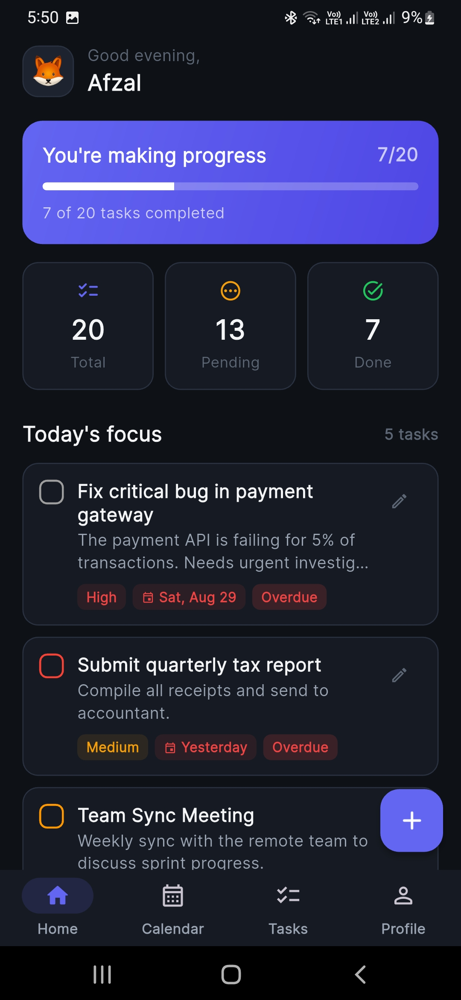
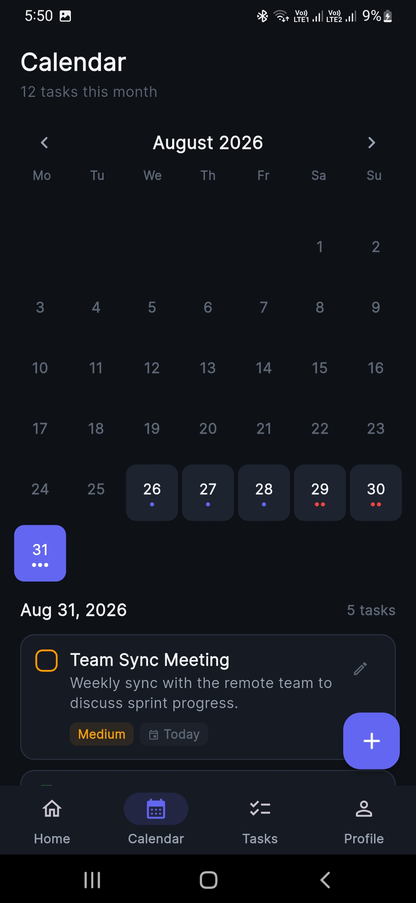
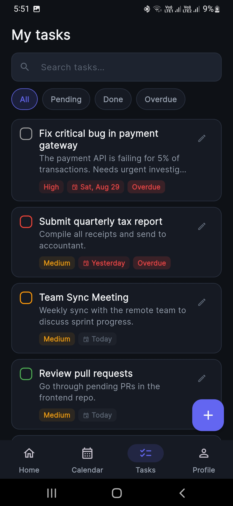
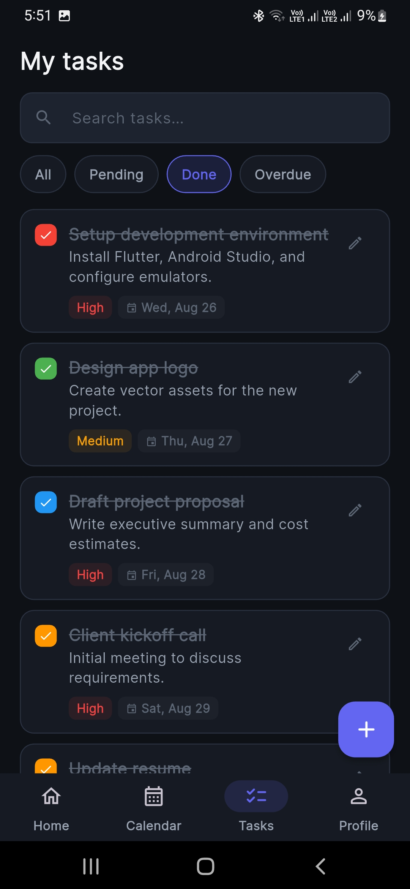
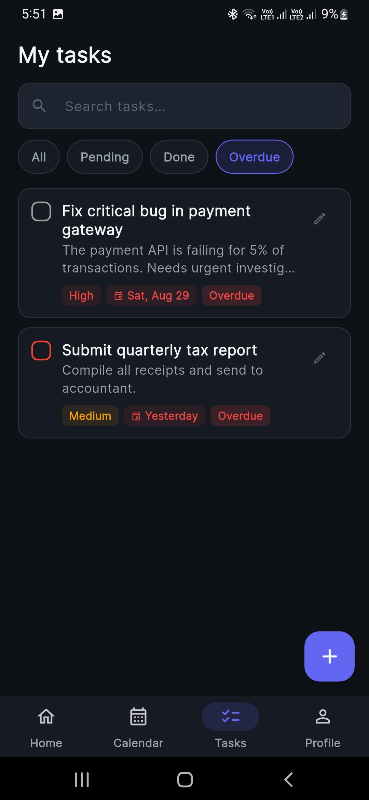
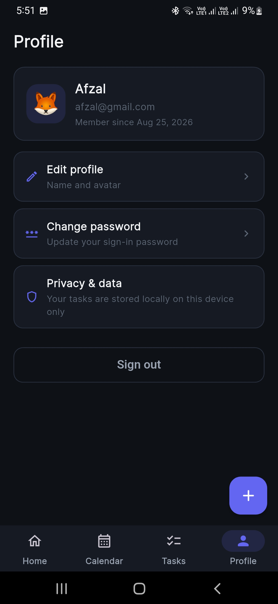

<div align="center">

# Taskly

**A local-first, secure task manager for Android, built with Flutter.**

[](https://flutter.dev)
[](https://developer.android.com)
[](https://pub.dev/packages/sqflite)

</div>

---

## Screenshots

<div align="center">

$$\textcolor{#A5B4FC}{\textsf{\textbf{Home\ dashboard}}}$$



Greets you by name and shows a daily progress bar plus Total / Pending / Done stat tiles. The "Today's focus" list surfaces today's tasks alongside overdue ones, each with a priority chip and due-date badge. Tap the FAB to add a task.

$$\textcolor{#818CF8}{\textsf{\textbf{Calendar}}}$$



Month view driven by real task data. Days with tasks show small dots (red when overdue), and tapping a day highlights it and lists that day's tasks below. Swipe the header arrows to change months.

$$\textcolor{#93C5FD}{\textsf{\textbf{My\ tasks\ (All)}}}$$



The full task list with a live search bar and filter chips. Each card shows title, notes preview, priority, and due date — overdue items get red "Overdue" badges. Tap the checkbox to complete, the pencil to edit.

$$\textcolor{#FBBF24}{\textsf{\textbf{My\ tasks\ (Pending)}}}$$


Same list filtered to open tasks only. Filters are instant — tapping a chip re-queries SQLite for the signed-in user, so you only ever see your own data.

$$\textcolor{#4ADE80}{\textsf{\textbf{My\ tasks\ (Done)}}}$$



Completed tasks with strikethrough titles and colored checkmarks that echo each task's color tag. Handy for reviewing what you've finished this week.

$$\textcolor{#F87171}{\textsf{\textbf{My\ tasks\ (Overdue)}}}$$



Shows only tasks past their due date, so nothing slips through the cracks. Combined with the home screen's "Today's focus", overdue work always stays visible.

$$\textcolor{#C084FC}{\textsf{\textbf{Profile}}}$$



Account hub: edit your name and avatar, change your password, sign out. The Privacy &amp; data entry notes that all tasks are stored locally on this device only.

</div>

---

## Contents

- [Screenshots](#screenshots)
- [Features](#features)
- [UX Details](#ux-details)
- [Security](#security)
- [Signing](#signing)
- [Tech Stack](#tech-stack)
- [Getting Started](#getting-started)
- [Testing](#testing)

---

## Features

- **Authentication** — register and sign in with email + password. Passwords are never stored in plaintext: they are hashed with PBKDF2-HMAC-SHA256 (120,000 iterations, per-user random salt) via the `crypto` package.
- **Authorization** — every task belongs to the signed-in user; all database queries are scoped by user id, so accounts cannot see each other's data.
- **Task management** — create, edit, complete, and delete tasks with title, notes, priority (low/medium/high), color tag, and due date.
- **Home dashboard** — greeting, daily progress bar, stats, and a *"Today's focus"* list that includes overdue items.
- **Calendar** — month view fed by real task data; days show task-count dots and a per-day task list.
- **All tasks** — search plus All / Pending / Done / Overdue filters.
- **Profile** — edit name/avatar, change password, sign out.

---

## UX Details

- Swipe a task row to delete it, with an **UNDO** snackbar.
- Pull-to-refresh on all lists.
- Inline form validation, password visibility toggles, loading states.
- Overdue badges, friendly relative dates (*"Today"*, *"Tomorrow"*).
- Layouts adapt to small screens (compact stat tiles, wrapping chips, scroll-safe forms).

---

## Security

<details>
<summary>Show security details</summary>

- **Password hashing** — passwords are stored as self-describing PBKDF2 hashes (`pbkdf2$<iterations>$<salt>$<hash>`), never in plaintext. Verification recomputes the hash and compares in constant time.
- **Legacy-account migration** — schema v1→v2 added per-user scoping (pre-auth rows are parked under userId `-1` so legacy data never leaks across accounts). Schema v2→v3 introduced hashing: existing plaintext rows are *not* silently converted. Instead, signing in with a legacy account routes through a password-reset screen (`lib/screens/auth/reset_password_screen.dart`) that stores the new password hashed. The reset path is only available while an account still holds an unhashed password, so secured accounts cannot be hijacked through it.

</details>

---

## Signing

<details>
<summary>Show release signing setup</summary>

Release builds are signed with a local keystore that is **not** committed:

1. Generate a keystore:
   ```sh
   keytool -genkey -v -keystore android/upload-keystore.jks \
     -keyalg RSA -keysize 2048 -validity 10000 -alias upload
   ```
2. Copy `android/key.properties.example` to `android/key.properties` and fill in your real passwords/alias. Both `key.properties` and `*.jks` are gitignored.
3. Build:
   ```sh
   flutter build apk --release
   ```

If `android/key.properties` is absent, release builds fall back to the debug signing config so `flutter run --release` still works on a fresh clone.

</details>

---

## Tech Stack

| Component | Location |
| --- | --- |
| Theme & design tokens | `lib/core/app_theme.dart` |
| Date helpers | `lib/core/date_utils.dart` |
| SQLite schema & migrations | `lib/helpers/database_helper.dart` |
| Password hashing | `lib/services/password_hasher.dart` |
| Auth service | `lib/services/auth_service.dart` |
| Task repository | `lib/services/task_repository.dart` |
| App shell | `lib/home_screen.dart` |
| Navigation tabs | `lib/screens/home_page.dart`, `lib/screens/tasks_page.dart`, `lib/calendar_screen.dart`, `lib/screens/profile_page.dart` |

---

## Getting Started

```sh
git clone https://github.com/Afzal20/taskmanager.git
cd taskmanager
flutter pub get
flutter run
```

---

## Testing

```sh
flutter test        # unit + widget tests
flutter analyze     # static analysis
```

The widget tests (`test/app_widget_test.dart`) cover the calendar grid, the All/Pending/Done/Overdue filter chips, and swipe-to-delete with UNDO restoring the exact original row id. They run the real SQLite schema on the host through `sqflite_common_ffi`.

---

<div align="center">

<sub>Built with Flutter</sub>

</div>
